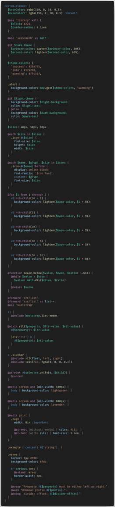
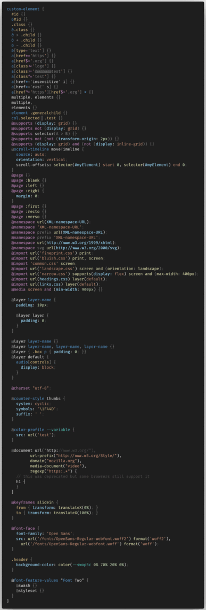
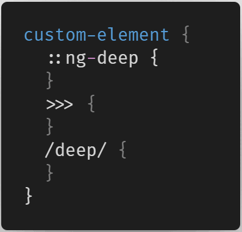
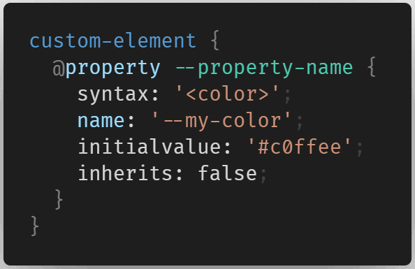
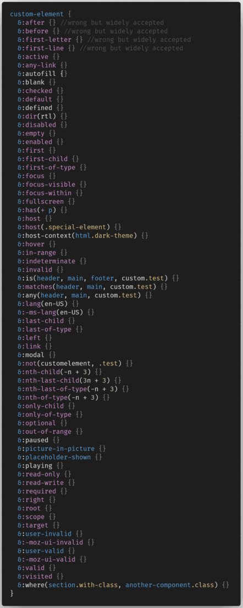
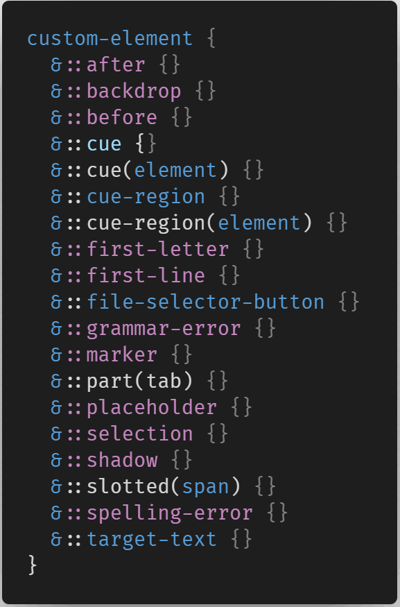

# vscode-angular-scss-inline

    

## Better SCSS Syntax Highlighting

This plugin is a inline style wrapper for [vscode-angular-scss](https://marketplace.visualstudio.com/items?itemName=ghaschel.vscode-angular-scss) and supports everything that said one does.

This plugin fixes the VSCode's messed up and feature-lacking SCSS syntax highlighting. Also adds some bleeding edge CSS features and Angular-Specific (although deprecated) selectors support

## Summary

- [vscode-angular-scss-inline](#vscode-angular-scss-inline)
  - [Better SCSS Syntax Highlighting](#better-scss-syntax-highlighting)
  - [Summary](#summary)
    - [General SCSS](#general-scss)
    - [General CSS](#general-css)
    - [Angular-Specific Selectors](#angular-specific-selectors)
    - [Houdini CSS](#houdini-css)
    - [Pseudo-Classes](#pseudo-classes)
    - [Pseudo-Elements](#pseudo-elements)
    - [XML Namespaces](#xml-namespaces)
  - [Disclaimer](#disclaimer)
  - [Changelog](#changelog)

### General SCSS

### General CSS

### Angular-Specific Selectors

### Houdini CSS

### Pseudo-Classes

### Pseudo-Elements

### XML Namespaces

## Disclaimer

> The development of this plugin serves as a way for me to train Regex, so may not be 100% correct. Feel free to submit a pull request or open an issue if needed.

## [Changelog](CHANGELOG.md)
